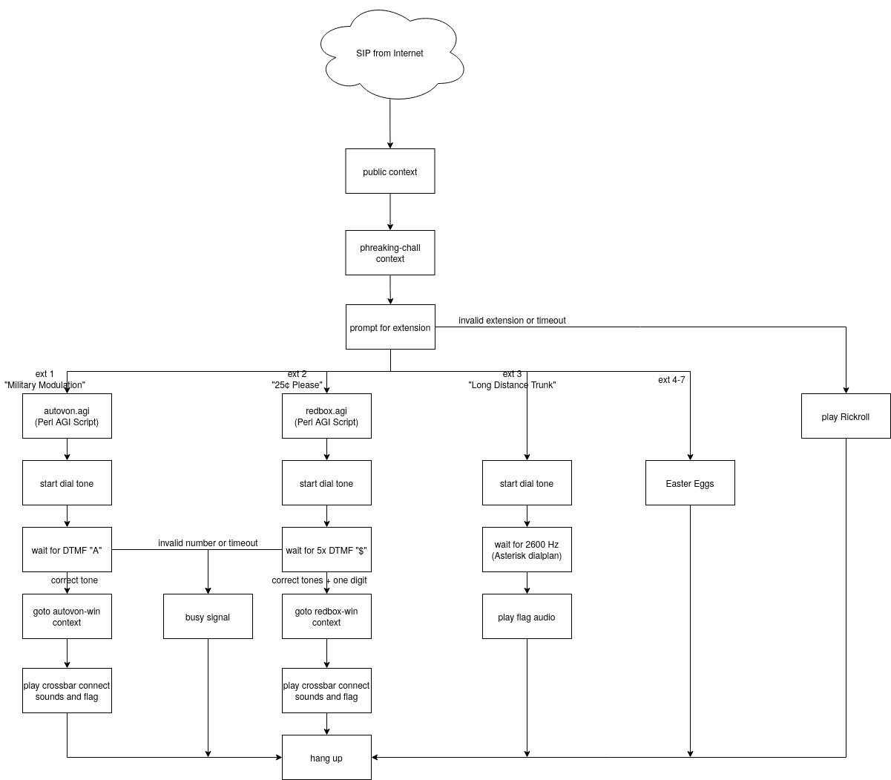

# FlamingSpork's Phone Challenges

For this year's [RITSEC](https://ritsec.club) CTF, I made these three phone phreaking challenges all because of an offhand joke about my fascination with telephone systems.
They're very unusual and were likely many competitors' first encounter with attempting phreaking.
According to people I've discussed it with, they were each reasonably challenging and required unearthing quite a bit of old knowledge.

# TL;DR
In short, I set up a server (using software intended for a business phone system) that receives calls and emulates certain aspects of a 1960s-era telephone exchange.
If you use the same techniques that were used to trick and tamper with phones back then, you can receive audio messages that have to be decoded to find the "flags" to win points.

# Attempting the Challenges
I have decided to leave the number and SIP address operational for a couple days after the CTF ends on April 3rd, but will shut it down if my server gets spammed.
Please do not message me asking for help with getting SIP to connect; I spent all weekend fielding DMs and am tired of even *thinking* about SIP.

## "Long Distance Trunk" [100→300 points]
### Clue
You're not going to pay for that call, are you?  
+1 (585) 358-0101 or s@140.238.152.111, extension #3

## "25¢, Please" [300 points]
### Clue
Oh no! Your telephone line has turned into a payphone! Insert your coins and dial a number.  
+1 (585) 358-0101 or s@140.238.152.111, extension #2

## Military Modulation [500 points]
### Clue
It's the middle of the Cold War and General Gordon needs to call the President to prevent nuclear war.  
See if you can help him out at +1 (585) 358-0101 or s@140.238.152.111, extension #1

# Solutions
Solutions, explanations, and inspiration for the challenges are in [`solve_writeup.md`](solve_writeup.md), which is left as a separate file to somewhat reduce spoilers.

# How I Built It
What follows is an in-depth technical explanation of how I built this, in enough detail that someone *might* be able to build their own, if they for some reason want to.

## Patching Asterisk for Modified DTMF
To avoid writing my own two-tone detector code for payphone/red box tones, I used [`hharte`'s patch](https://github.com/hharte/1dcoinctrl/blob/master/asterisk/main/0001-Modify-DTMF-matrix-to-decode-1700-2200Hz-coin-tones.patch) to Asterisk's DTMF detector, which added the extra digit `$`.
This patch could not be applied directly due to changes in more recent versions of Asterisk, so I ported it forward to make [my version of `dsp.c`](src/main/dsp.c).
In his code, E through L are dashes, but I ran into an issue in which `$` was getting detected as one of the dashes, so I put a unique letter on each, rather than trying to debug tolerances in C written in 2005.
For some reason, digits beyond the first row are read incorrectly, but consistently incorrectly, so I just put the incorrect ones in my dialplan and in my AGI scripts.

|           | **1209 Hz** | **1336 Hz** | **1477 Hz** | **1633 Hz** | **_2200 Hz_** |
|-----------|-------------|-------------|-------------|-------------|---------------|
| 697 Hz    | 1           | 2           | 3           | A           | *E*           |
| 770 Hz    | 4           | 5           | 6           | B           | *F*           |
| 852 Hz    | 7           | 8           | 9           | C           | *G*           |
| 941 Hz    | *           | 0           | #           | D           | *H*           |
| *1700 Hz* | *I*         | *J*         | *K*         | *L*         | *$*           |

*italicized digits and tones are not present in standard DTMF*

## Building and Installing Asterisk
After patching it, it ended up being pretty easy to actually build and install, although I did need to create the user for it and `chown` all the files myself.
For the Perl AGI scripts, I installed `asterisk-perl`.

A more detailed but less comprehensible explanation of what I did to build and install it is in [install.md].

## voip.ms
For accepting calls from the Public Switched Telephone Network, I used [voip.ms](https://voip.ms) to get a Direct Inbound Dialing line, which I paid about US $5 for a month with unlimited inbound calling.
I chose voip.ms because they have [good documentation](https://wiki.voip.ms/article/Asterisk_PJSIP), and, more importantly, they're cheap.
To be clear, I was not sponsored by them in any way for this project.

After buying the number, I made sure that they were sending DTMF tones in-band, rather than as a SIP message, both in their web interface and in [my PJSIP config](config/pjsip.conf).

## PJSIP Config
In order to accept inbound SIP calls with the particular network setup I used, I had to [gaslight and girlboss my SIP packets through NAT](https://twitter.com/kimlikesflowers/status/1502478844204355587).
Fortunately, Asterisk/PJSIP supports this natively and it was easy to put in [my config](config/pjsip.conf).

I also added an anonymous endpoint that could be used as a SIP address to allow competitors without cheap calls to telephone numbers in the United States to call.

For both of these, I had to make sure that DTMF was in-band to actually get it through to my challenges.

Calls from actual phones are received by voip.ms, which forwards them over the internet to my server in the same way that SIP software phones connect.

## Converting Audio and Building Dialplan
I created a dialplan context that accepts calls from voip.ms and from anonymous SIP and then forces all calls into the `phreaking-chall` context, which had extensions for each of the challenges and easter eggs.

To convert audio into the particular variety that Asterisk likes and make later transcoding easier, I ran all my audio files through this FFmpeg incantation:
`ffmpeg -i input.file -ar 8000 -ac 1 -acodec pcm_s16le -f s16le output.sln`

## Modifying `payphone.agi`
AGI (Asterisk Gateway Interface) is Asterisk's API for expanding functionality through fully custom programs, which are often written in languages wholly unsuited for it.  
[`payphone.agi`](https://github.com/hharte/1dcoinctrl/blob/master/asterisk/agi-bin/payphone.agi) is a script designed to emulate the central office setup required for a payphone.
It makes a dialtone, waits for digits and coin tones, and plays recordings of connection sounds from crossbar switches and served as a good starting point for my redbox and AUTOVON challenges, especially since it seems more intuitive than conditionals in dialplans.
In addition, it includes [several audio files recorded from crossbar systems](https://github.com/hharte/1dcoinctrl/tree/master/asterisk/sounds), which were helpful in making it sound more authentic.
In the limited time I was able to spend on this project, I couldn't be bothered to actually learn Perl or rewrite the script from scratch, which led to some issues later.

## Blue Box
Instead of figuring out how to detect a single tone rather than a DTMF pair in a Perl AGI script, I found the `WaitForTone()` function in the [Asterisk docs](https://wiki.asterisk.org/wiki/display/AST/Asterisk+18+Application_WaitForTone).
This isn't an accurate emulation at all and gives a lot less feedback than the other challenges, but it lets you use the most famous 2600 Hz feature of a blue box.
I used Audacity to make an audio file with DTMF tones to the flag, which I aimed to be the easiest one of mine to find.
After it was posted, it was clear that it was not be as easy as I had hoped, so we raised it to 300 points.

## AUTOVON
The script that runs it can be found in: [`autovon.agi`](agi-bin/autovon.agi)  
I removed a significant portion of `payphone.agi` and made it detect the AUTOVON Flash Override (`A`) tones as a coin, since this seemed easier than trying to get DTMF detection in a dialplan.
If 5¢ (one press of the `A` button) was received, it played the flag, but it gave a busy signal if any other buttons were heard or if it timed out waiting for a digit.

I made the flag using `echo "FLA\$HG0RDONOVERRID3" | minimodem --tx tdd -f TDD.flac`, which I made play three times specifically to get it to work with [TTY/TDD drawers](https://twitter.com/Flaming_Spork/status/1504902391094784006) and to hopefully minimize decoding problems.

## Redbox
AGI script: [`redbox.agi`](agi-bin/redbox.agi)  
Since the script was originally intended to be compatible with a red box as well as with real payphones, very little modification was required to make it work in this setup.
The main things I did were to make it not expect a phone number to dial and not allow certain free calls.
In the end, I didn't manage to truly defeat the requirement for entering at least one digit after inserting coins, so I explained it in the challenge description.

## Easter Eggs/Call Testing
I left a few audio files in the system to make sure my dialplan worked correctly

* 4: [Never Gonna Give You Up](https://www.youtube.com/watch?v=dQw4w9WgXcQ)
* 5: [Touch-Tone Telephone](https://www.youtube.com/watch?v=rbxL5BVEkRs)
* 6: TDD audio that I used for [this tweet](https://twitter.com/Flaming_Spork/status/1504902391094784006) (in `sounds/bgdc.{flac,sln}`)
* 7: [this line from The Owl House](https://youtu.be/2o695sEsplE?t=14) with a bit of dialtone after it

# Random Issues
* DTMF tolerances were so broken that I had to use different digits
* Blocking SIP scanners
(no, my server does *not* have an outbound route to reach phone numbers in England, please stop trying)
* logs overfilling the disk
* why is this failing through to rickroll?
(it turns out that my dialplan was more convoluted than I thought)
* my absurd laziness
* weird NAT issues
* lack of testing of SIP calling before the competition started

# Successes/Statistics
There were 38 total successful solves, and 412 total phone calls during the CTF, although this number may have been skewed by SIP scanners.

Per-challenge breakdown:
* "Long Distance Trunk" [100→300 points]: 13 solves
* "25¢, Please" [300 points]: 18 solves
* Military Modulation [500 points]: 7 solves

Call type breakdown:
* 263 anonymous SIP calls
* 151 phone calls through voip.ms

The system received telephone calls from all over the world, including:
* United States (+1)
* Canada (+1)
* Taiwan (+886)
* South Korea (+82)
* Australia (+61)
* Italy (+39)
* Spain (+34)
* Vietnam (+84)

After compiling these statistics, I have deleted all of the records they were compiled from.
I was under the impression that my system was not collecting caller ID information, as voip.ms lists a charge per lookup, which I explicitly declined.

If you participated, thank you, and if you didn't, thank you for reading anyway.

# Want to learn more?
* _Exploding the Phone_ by Phil Lapsley is an excellent read and my introduction to phone phreaking
* [The Connections Museum](https://www.youtube.com/user/museumofcomm) in Seattle has a very good YouTube channel where they talk about repairing their telephone switches
* [The Telephone Museum](https://thetelephonemuseum.org/) in Ellsworth, Maine (near Bangor) is also a fun visit if you're around
* [ProjectMF](http://www.projectmf.org/intro.html)
* [Virtual Blue Box](https://phreaknet.org/bluebox/) proved useful in my testing, as did [ToneDef (Android app)](https://github.com/Fortyseven/ToneDef)
* [RITSEC](https://ritsec.club) is a computer security club at the [Rochester Institute of Technology](https://www.rit.edu), where I'm a student
