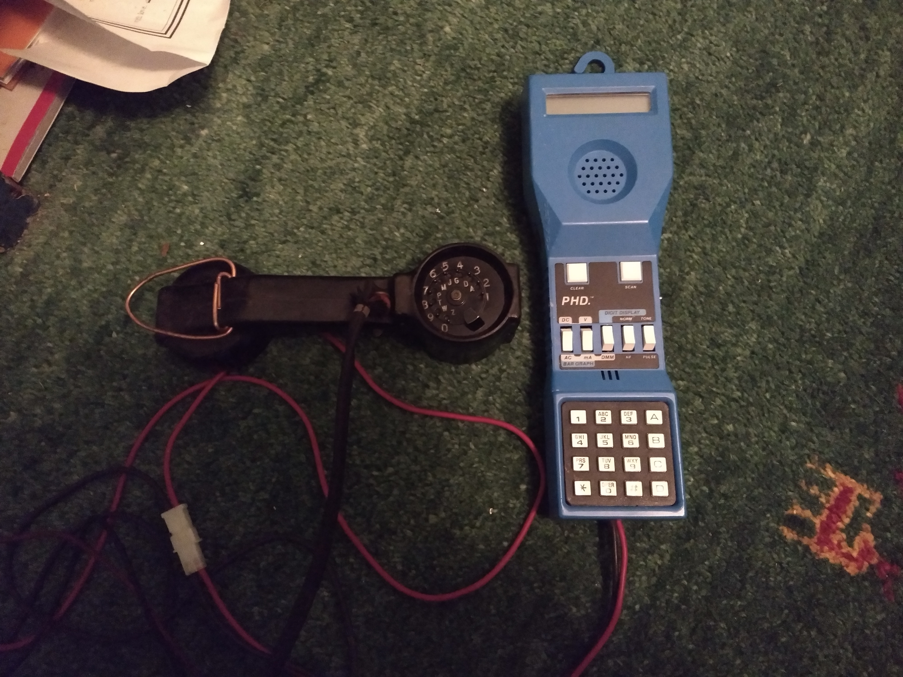

# Solutions to Phone Challenges
Until April 10th, 2022, these can be accessed by calling +1 (585) 358-0101 from a regular phone or s@140.238.152.111 from a SIP phone.
SIP phone support is provided to allow callers from outside the US cheaply and to allow better call quality than through cell networks.  

## "Long Distance Trunk" [100→300 points]
### Clue
You're not going to pay for that call, are you?  
+1 (585) 358-0101 or s@140.238.152.111, extension #3

### How/why it works
As I discussed in my most recent [RITSEC research presentation](https://www.youtube.com/watch?v=qdciYBQngdk), a 2600 Hz tone was used to indicate that a long distance trunk line is empty.
A blue box generates this tone and provides a keypad for dialing the MF (not to be confused with DTMF) tones (as well as ST and KP tones) needed to create a new call.
This challenge simply detects the 2600 Hz tone and plays a flag, rather than requiring a number, but it still requires the most memorable blue box feature. 

[DTMF](https://en.wikipedia.org/wiki/Dual-tone_multi-frequency) tones are the tones that all touch-tone telephones use to indicate digits, which work by making two tones at the same time.
It replaces the disconnecting and reconnecting of the line that rotary phone dials do with in-band signalling for faster and more efficient dialing.

When I first started thinking up these challenges, I knew that there *needed* to be a blue box challenge, since that's the first phreaking thing that anyone learns about.
Surprisingly, this one turned out to be harder (or at least have fewer solves) than the red box challenge, although I think that's from a combination of [overfamiliarity with phone systems](https://xkcd.com/2501/) and a poorly-worded description.

### Solving/Testing
Go to https://phreaknet.org/bluebox/ and hold your phone's microphone near the computer's speakers while also recording the phone call.  
Dial the phone call, press 3 to get to the challenge, and press the 2600 Hz button.  
Make sure that the 2600 Hz tone plays for more than 500ms (½ second), otherwise the detection won't work.  
You should hear a series of nine beeps that sounds like [this](sounds/DTMF.wav), which can be decoded using various DTMF decoders or by manually comparing with the known DTMF tones.

### Flag
`*9035768*`

## "25¢, Please" [300 points]
### Clue
Oh no! Your telephone line has turned into a payphone! Insert your coins and dial a number.  
+1 (585) 358-0101 or s@140.238.152.111, extension #2

### How/why it works
Until the early 2000s, payphones in most of the US and Canada used a series of 1700+2200Hz tones to indicate how many coins had been inserted, with each 66 ms beep representing a nickel.  
Playing those tones back into the handset would trick the telephone switch into thinking that money had been inserted and would let the call go through.

The ["red box"](https://en.wikipedia.org/wiki/Red_box_(phreaking)) that made these tones (or a tape recording of them) was one of the most common phreaking tools and remained useful long after blue box-able long distance systems were shut down.

I chose reversed speech for the flag because it felt period-appropriate to when phreaking was happening, and I like the idea of people tampering with phone systems and running into the extraordinary that reversed speech like that kinda represents.
If you like that idea (of picking up a phone, trying to phreak, and running into a demon or something) too, I've written [a few stories](https://philo.gay/stories) that are tangentially related.

### Solving/Testing
Go to https://phreaknet.org/bluebox/ and hold your phone's microphone near the computer's speakers while also recording the phone call.
Dial the phone call, press 2 to get to the challenge, and press the 1-slot 25¢ button and then any button on the keypad.
If everything's working correctly, you'll hear [this backwards speech](sounds/Reversed.wav).
Take your recording of the speech and use Audacity or some other audio editing tool to play it backwards to get the flag.

### Flag
`R3VERSED_CALL`

## Military Modulation [500 points]
### Clue
It's the middle of the Cold War and General Gordon needs to call the President to prevent nuclear war.  
See if you can help him out at +1 (585) 358-0101 or s@140.238.152.111, extension #1

### How/why it works
In the 60s, the US military and AT&T built the [AUTOVON](https://en.wikipedia.org/wiki/Autovon) system, a parallel telephone network to the Bell System.  
Due to the limited number of long distance lines available, they added a buttons for *precedence levels*, which a caller could press to make the system drop other calls in favor of theirs.  
The levels were known as Flash Override, Flash, Immediate, Priority, and Routine, with the last one being the default.  
*Flash Override* was intended only for use in a serious military emergency, which a nuclear war would most likely count as, and is signalled with the [DTMF](https://en.wikipedia.org/wiki/Dual-tone_multi-frequency) tone `A` (697/1633 Hz).  

A [Telecommunications device for the deaf (TDD)](https://en.wikipedia.org/wiki/Telecommunications_device_for_the_deaf) is a system that allows text to be transmitted over a telephone line.  
In most countries, there's a TDD relay service that deaf people can call and be connected with a relay operator, who will speak on their behalf and relay the conversation over the TDD.  
The TDD works by encoding letters as a series of frequency-modulated Baudot beeps at 10 characters a second.
The system was designed for civilian use, which led some people looking at the clue down the wrong path for some sort of military RTTY.  

I've configured my telephone system to listen for the `A` tones on the line connected to extension 1 and play the TDD tones that make up the flag when it gets `A`.  
The flag and clue are a play on the title of the film Flash Gordon, which I haven't actually seen, but I know has an outstanding Queen soundtrack.

I came up with this challenge after looking at my line~~man~~woman's set, which has buttons for the AUTOVON tones and after wondering what it would take to use a [payphone TTY](https://twitter.com/Flaming_Spork/status/1504902391094784006) for its intended purpose.

### Solving/Testing
Go to https://phreaknet.org/bluebox/ and hold your phone's microphone near the computer's speakers while also recording the phone call.
Dial the phone call, press 1 to enter the challenge (on your phone or on the DTMF Tone Generator on the website), listen for the dialtone, and click `A`.  
If everything's working correctly, you'll hear this [series of beeps](sounds/TDD.wav) that repeats three times.  
Run the recording of the beeps through a TDD decoder, such as [minimodem](http://www.whence.com/minimodem/) or [TTY Angel](http://www.ciscounitytools.com/Applications/General/TTYAngel/TTYAngel.html) to get the flag.  

### Flag
`FLA$HG0RDONOVERRID3`
